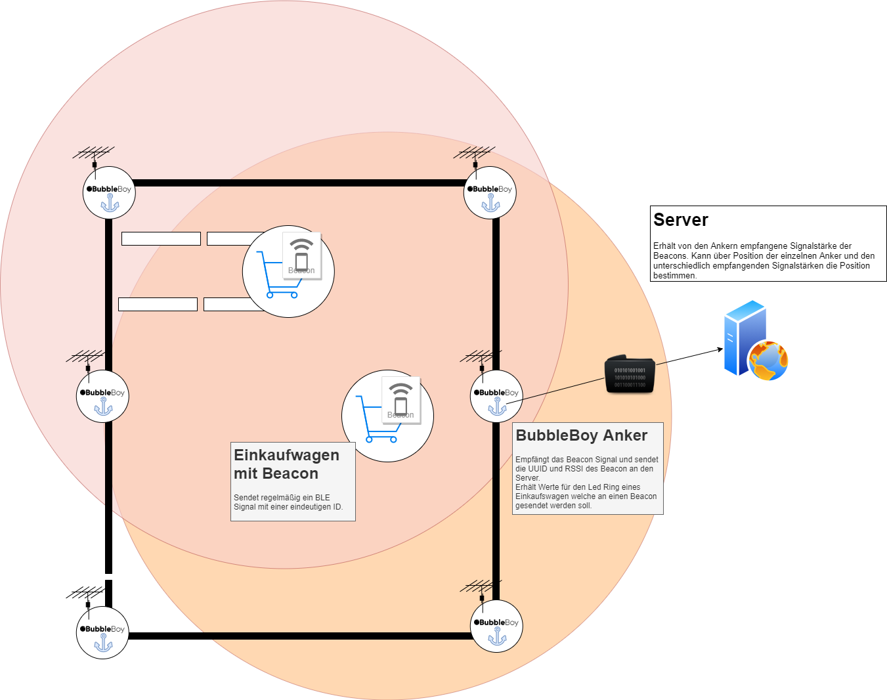

# bubbleBoy

Stationary anchor for tracking beacons.

This design was part of the [Make@thon](http://opto-cubes.de/?p=115) competition.

The anchor receive BLE beacon messages and sends these over MQTT to a server.

*This is a concept developed in a 2-day competition!*

## Setup

Follow this [heltec setup guide](https://heltec-automation-docs.readthedocs.io/en/latest/esp32+arduino/quick_start.html) to add the ESP32 board  to your IDE.
Following libraries are used:

- `BLE*`  [espressif/arduino-esp32](https://github.com/espressif/arduino-esp32)
- `PubSubClient` [knolleary/pubsubclient](https://github.com/knolleary/pubsubclient)

## Arrangement

## TODO / Improvements

Duo to the time limits we were not able to implement all of the planed features.

- *Downlink*: Send the data from the anchor to the beacon
